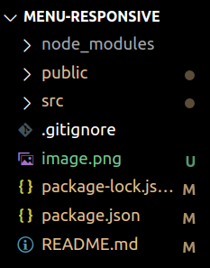

# Introduccion a react

En esta seccion se desarrollara de manera progresiva y sistematica un "Hamburguer menu", con el proposito de tener un acercamiento con la arquitectura de react y sus conceptos fundamentales para la construccion de interfaces de usuario modernas.

## Primeros pasos

Abrir la terminal e inicializar un nuevo proyecto utilizando `create-react-app`, este ultimo es es una herramienta de línea de comandos (CLI) desarrollada por Facebook que facilita la creación y configuración de proyectos de React de manera rápida y sencilla. Su objetivo principal es simplificar el proceso de configuración inicial de un entorno de desarrollo React, lo que permite a los desarrolladores comenzar a trabajar en sus aplicaciones de React sin tener que preocuparse por configurar manualmente todas las dependencias y archivos necesarios.

```
npx create-react-react <nombre-proyecto>
```

Notar que se ha utilizado `npx`, el cual es una herramienta que viene incluida con npm (Node Package Manager) a partir de la versión 5.2.0 en adelante. Su función principal es ejecutar paquetes Node.js directamente desde el registro npm, sin necesidad de instalarlos de forma global o local en tu sistema. 

Luego de eso se habran creado y configurado los archivos fundamentales para la ejecucion de un proyecto con react, para ello se utilizara el siguiente comando que se encargara de correr un script definido dentro del archivo `package.json`.

```npm start```

Notar que se abrira el navegador con la ejecucion del proyecto y en la consola se podra visualizar cierta informacion como el puerto utilizado y una direccion ip que tambien puede ser accedida dentro de la misma red. 

## Desarrollo

Luego de la inicializacion del proyecto se tendra una estructura de directorios como la siguiente: 



Dentro del directorio `public` encontraremos el archivo `ìndex.html` de toda la vida, algo importante a destacar es que dentro del `body` se encuentra: ``<div id="root"></div>`` esto es una convención y una parte fundamental del funcionamiento de una aplicación React por varias razones, pero principalmente porque el elemento con el id "root" actúa como el punto de montaje principal de tu aplicación React. Es aquí donde React "montará" y "renderizará" los componentes de tu aplicación. Cuando React inicia la aplicación, busca este elemento en el DOM y comienza a renderizar los componentes dentro de él.:


```html
...
  <body>
    <div id="root"></div>
  </body>
```

Luego centraremos la atencion en el directorio `src` en el cual, se encuentra el codigo relacionado a los componentes de react.

<br>

---
<br>

Archivo: `App.js`

Primeramente, se importa un archivo CSS llamado "App.css". Este archivo CSS se utiliza para aplicar estilos específicos al componente App y a sus componentes secundarios. 

```jsx
import './App.css';
```

Luego, se importa un componente React llamado Navbar desde el archivo "./components/Navbar".

```jsx
import Navbar from './components/Navbar';
```

**Nota**: Un componente en React es una parte reutilizable y autocontenida de la interfaz de usuario de una aplicación. Se crean utilizando JavaScript y JSX (JavaScript XML), que es una extensión de JavaScript que permite escribir estructuras de elementos HTML dentro del código JavaScript. Los componentes pueden tener propiedades (props) que son datos que se pasan a un componente desde su componente principal, y pueden tener su propio estado interno que les permite mantener y gestionar información específica.


Posteriormente se define el el componente App. Es una función llamada App que devuelve JSX. En este caso, el componente App renderiza el componente Navbar. ```<Navbar/>``` es una etiqueta JSX que representa la instancia del componente Navbar. Cuando App se renderiza, también se renderiza el componente Navbar como parte de su contenido.

```jsx
function App() {
  return (
    <>
      <Navbar/>
    </>
  );
}
```

Con respecto a:

```jsx
<>
...
</>
```

Representan lo que se llama un "fragmento" en React. Los fragmentos son una característica de JSX que te permite envolver múltiples elementos JSX sin tener que crear un elemento adicional en el DOM. 

Finalmente, se exporta el componente App como el componente principal de este archivo. Esto significa que este componente puede ser importado y utilizado en otros archivos de la aplicación.

```jsx
export default App;
```
---
<br>


Archivo: `index.js`:

Las dos primeras líneas importan las bibliotecas React y ReactDOM. React es necesario para que los componentes React funcionen correctamente, y ReactDOM es la biblioteca que se utiliza para renderizar componentes de React en el DOM.

La tercera línea importa un archivo CSS llamado "index.css". Esto suele ser un archivo de estilos globales para la aplicación.

La cuarta línea importa un componente llamado App desde el archivo "App.js". Esto asume que tienes un componente llamado App definido en ese archivo.

```jsx
import React from 'react';
import ReactDOM from 'react-dom/client';
import './index.css';
import App from './App';
```

La siguiente línea crea una raíz de ReactDOM utilizando ReactDOM.createRoot(). Esto es una característica introducida en React 18 para habilitar el modo concurrente. document.getElementById('root') selecciona el elemento HTML con el id "root", que es donde se montará la aplicación React.

```jsx
const root = ReactDOM.createRoot(document.getElementById('root'));

```

Luego, la aplicación React se monta en la raíz que se creó anteriormente. Se utiliza <React.StrictMode> que es un componente de React que activa algunas comprobaciones de desarrollo adicionales en el modo de desarrollo. Dentro de este componente, se renderiza el componente App.

```js
root.render(
  <React.StrictMode>
    <App />
  </React.StrictMode>
);
```
---

<br>

Seguido de lo anterior, se creara un directorio llamado `components`, que contendra el codigo fuente relacionado al `Hamburguer menu`.

Archivo: `NavBar.jsx`

**Nota:**Los archivos que representen un componente de react, deberan ser nombrados con la letra inicial en mayuscula.

El siguiente bloque de codigo, importa las dependencias necesarias para este componente. React es la biblioteca principal de React, useState se utiliza para gestionar el estado local del componente, styled-components se utiliza para crear estilos con CSS-in-JS, y BurguerButton es un componente importado desde otro archivo (sera explicado mas adelante).

```js
import React, { useState } from 'react'
import styled from 'styled-components'
import BurguerButton from './BurguerButton'

```

Antes de continuar, se abordara un poco acerca de los **estados** en react:

En React, el "estado" (state en inglés) es un objeto que almacena información que puede cambiar con el tiempo y que afecta la representación y el comportamiento de un componente. El estado es una parte fundamental de cómo React permite que los componentes se vuelvan dinámicos y reactivos a las interacciones del usuario y a los cambios de datos.

**Aspectos clave:**

**Declaración del Estado:** Puedes declarar el estado de un componente utilizando el hook useState (en componentes funcionales) o definiendo una propiedad state (en componentes basados en clases).

```jsx
// En un componente funcional
const [estado, setEstado] = useState(valorInicial);

// En un componente basado en clases
this.state = {
  estado: valorInicial
};

```

**Acceso al Estado:** Para acceder al estado, puedes utilizar la variable estado (en componentes funcionales) o this.state.estado (en componentes basados en clases). Sin embargo, nunca debes modificar el estado directamente; en su lugar, debes usar la función setEstado (en componentes funcionales) o this.setState (en componentes basados en clases) para actualizarlo.

**Actualización del Estado:** Para actualizar el estado, llamas a la función setEstado o this.setState y le pasas el nuevo valor que deseas asignar al estado. React se encarga de fusionar y aplicar los cambios adecuadamente.

**Efectos del Estado:** Cuando cambia el estado de un componente, React vuelve a renderizar el componente y actualiza la interfaz de usuario para reflejar esos cambios. Esto hace que los componentes sean reactivos a las interacciones del usuario y a los cambios de datos.

**Inmutabilidad del Estado:** El estado en React debe tratarse como inmutable. En lugar de modificar directamente el estado existente, debes crear un nuevo objeto de estado con los cambios y asignarlo utilizando setEstado o this.setState. Esto es fundamental para el funcionamiento adecuado de React y para evitar problemas de rendimiento.

**Uso del Estado:** El estado se utiliza para almacenar datos que afectan la representación visual del componente, como datos de formulario, datos de usuario autenticado, datos de una lista que se renderiza, etc.

Dejando claro lo anterior, se define una función llamada Navbar, que es el componente principal de la barra de navegación.

```jsx
function Navbar() {
```

Luego, se utiliza el hook useState para declarar una variable de estado llamada clicked y una función para actualizarla llamada setClicked. La variable clicked se inicializa en false y se utiliza para controlar el estado de la barra de navegación (si está abierta o cerrada).

```jsx
  const [clicked, setClicked] = useState(false)
```

**Nota:** Los hooks en React son funciones especiales que te permiten "enganchar" o acceder a características de React en componentes funcionales. Antes de la introducción de los hooks, las características de React, como el estado y los ciclos de vida, solo estaban disponibles en componentes basados en clases. 

Dado lo anterior, se define una función llamada handleClick que se ejecuta cuando se hace clic en un enlace de navegación. Esta función cambia el estado clicked de true a false o de false a true, alternando entre los dos estados.

```jsx
  const handleClick = () => {
    //cuando esta true lo pasa a false y viceversa
    setClicked(!clicked)
  }
```

El componente Navbar devuelve un fragmento <> para envolver su contenido. Luego, comienza a renderizar la barra de navegación dentro de un componente NavContainer.

```jsx
  return (
    <>
      <NavContainer>
      ...

```

Se renderiza un encabezado ```<h2>``` con el texto "Menu" y la palabra "Hamburguer" dentro de un ```<span>```. Esto parece ser un título para la barra de navegación.

```html
<h2>Menu <span>Hamburguer</span></h2>
```

Luego, se crea un ```<div>``` con la clase links. Si clicked es true, se agrega la clase active al ```<div>```. Esto se usa para aplicar estilos cuando la barra de navegación está abierta.

```jsx
   <div className={`links ${clicked ? 'active' : ''}`}>
```

a continuacion, se renderizan una serie de enlaces ```<a>``` que representan las opciones de navegación. Cada enlace tiene un evento onClick que llama a la función handleClick cuando se hace clic. Esto se utiliza para cambiar el estado clicked y controlar la apertura y cierre de la barra de navegación.

```jsx
<a onClick={handleClick} href="#h">Home</a>
<a onClick={handleClick} href="#h">Reserve</a>
<a onClick={handleClick} href="#h">Contact us</a>
<a onClick={handleClick} href="#h">Request</a>
```

por ende, se renderiza un componente llamado BurguerButton, que representa el icono para abrir y cerrar la barra de navegación. El estado clicked y la función handleClick se pasan como props a este componente.

```jsx
<div className='burguer'>
    <BurguerButton clicked={clicked} handleClick={handleClick} />
</div>
```

**Nota:** Los props son un mecanismo fundamental para pasar datos de un componente padre a un componente hijo en la jerarquía de componentes de una aplicación React. Los props permiten que los componentes se comuniquen entre sí y compartan información de manera efectiva.


Se renderiza un elemento ```<BgDiv>``` con clases condicionales para aplicar estilos dependiendo del estado clicked.

```jsx
<BgDiv className={`initial ${clicked ? ' active' : ''}`}></BgDiv>
```

Finalmente, el componente Navbar se cierra y se exporta para que pueda ser utilizado en otros lugares de la aplicación.

```jsx
       </NavContainer>
    </>
  )
}
export default Navbar
```

---
<br>

`Archivo: BurguerButton.jsx`

Se importan los modulos necesarios:

```jsx
import React from 'react'
import styled from 'styled-components'
```

La siguiente funcion define el componente BurguerButton. Este componente toma props como argumento y renderiza un botón de hamburguesa estilizado.

```jsx
function BurguerButton(props) {
  return (
    <Burguer>
      <div
        onClick={props.handleClick}
        className={`icon nav-icon-5 ${props.clicked ? 'open' : ''}`}
      >
        <span></span>
        <span></span>
        <span></span>
      </div>
    </Burguer>
  )
}
```
Veamos las partes clave: 

```function BurguerButton(props) { ... }``` : Se define una función de componente de React llamada BurguerButton que toma props como argumento.

```<Burguer> ... </Burguer>``` : Se utiliza el componente Burguer (definido más abajo) para envolver el contenido del botón de hamburguesa. Esto permite aplicar estilos específicos a este botón.

```<div ...> ... </div>``` : En este div, se crea el botón de hamburguesa en sí. Aquí están las propiedades importantes:

```onClick={props.handleClick}``` : Esta propiedad asigna la función handleClick pasada como prop al evento de clic en el botón. Cuando se hace clic en el botón de hamburguesa, esta función se ejecutará.

```className={icon nav-icon-5 ${props.clicked ? 'open' : ''}}``` : Esta propiedad establece la clase CSS del botón de hamburguesa. Dependiendo del valor de props.clicked, se agrega la clase 'open' al botón, lo que generalmente se utiliza para cambiar la apariencia del botón cuando se ha abierto un menú de navegación.

Dentro del div, se crean tres elementos span. Estos elementos representan las líneas que forman el icono de hamburguesa típico. Por lo general, cuando se abre el menú de navegación, estas líneas se transforman en una "X" para indicar que el menú está abierto.

Al final, se exporta el componente BurguerButton como el valor predeterminado del módulo, lo que permite importarlo y utilizarlo en otros archivos de React.

```jsx
export default BurguerButton
```

luego, se comienza a definir el componente Burguer utilizando styled-components. Esto permite aplicar estilos CSS específicos al componente Burguer. 

```jsx
const Burguer = styled.div``
```

**Nota:** styled-components es una biblioteca para React que permite crear componentes estilizados mediante el uso de estilos CSS en JavaScript. En lugar de definir estilos CSS en archivos separados o en línea en tus componentes de React, styled-components te permite definir los estilos directamente en tus componentes de manera declarativa y dinámica. Esto hace que la gestión de estilos en tus aplicaciones React sea más sencilla y mantenible.

Al final de ambos archivos (BurguerButton.jsx y NavBar.jsx), se encuentran los estilos de CSS aplicados a cada componente en particular. 

**El siguiente enlace contiene distintos estilos que pueden utilizarse para el icono del Hamburguer Menu:** https://codepen.io/ahmadbassamemran/pen/VQwPGr